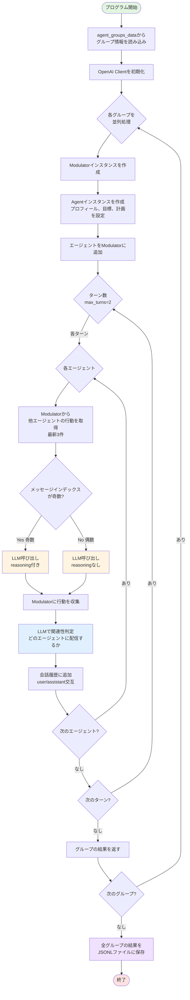
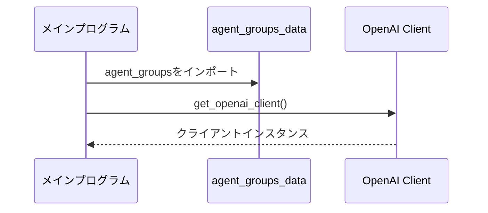
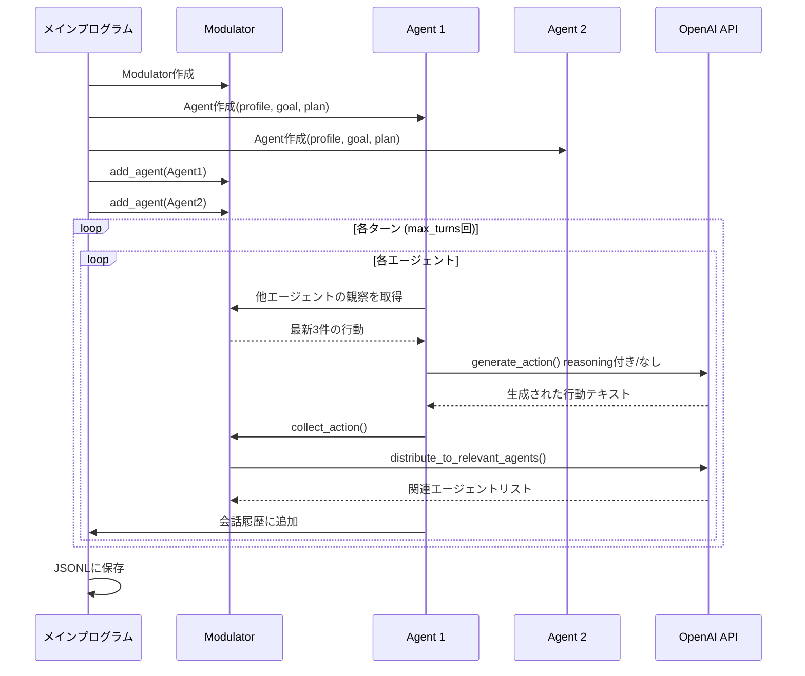
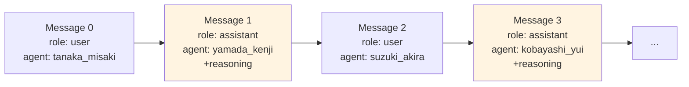
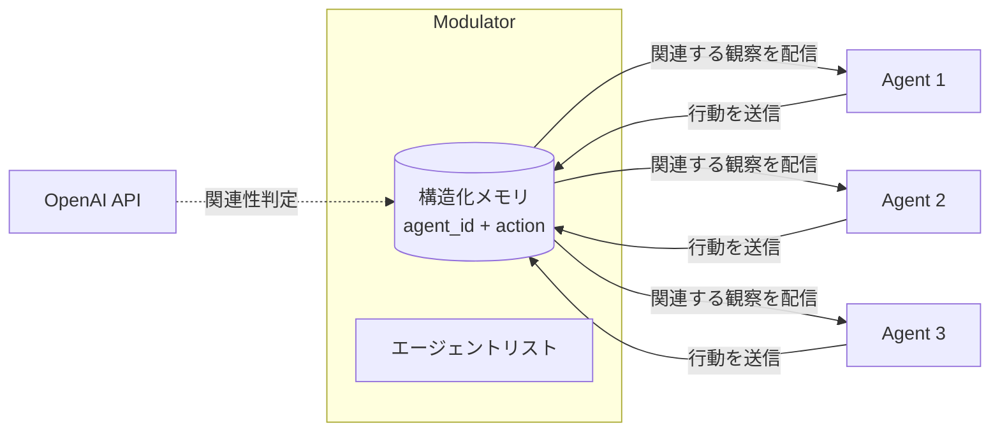
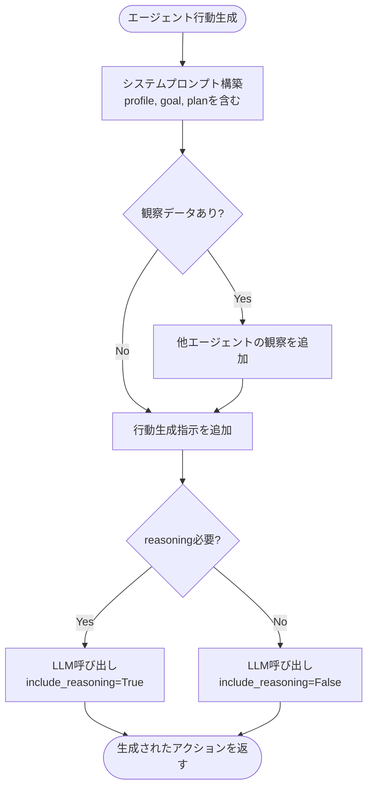
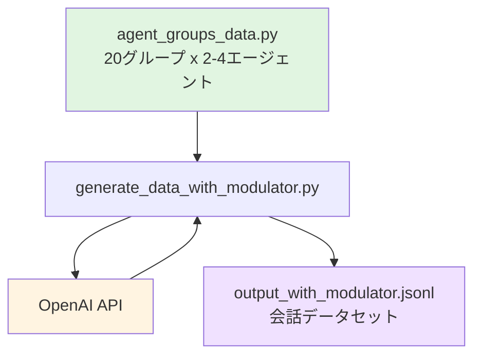

# 会話生成フロー図

このドキュメントでは、マルチエージェント会話データ生成システムの処理フローを図解します。

## 1. 全体フロー

## 2. 初期化フェーズ

## 3. グループ処理フェーズ（各グループごと）

## 4. 会話履歴の構造

**メッセージインデックスとrole/reasoningの対応:**
- 偶数インデックス (0, 2, 4, ...) → `role: "user"` (reasoningなし)
- 奇数インデックス (1, 3, 5, ...) → `role: "assistant"` (reasoning付き)

## 5. Modulatorの役割

## 6. エージェント行動生成の詳細

## システムパラメータ

現在のシステム設定：

| パラメータ | 値 | 説明 |
|----------|-----|------|
| グループ数 | 20 | 並列処理される |
| エージェント数/グループ | 2〜4人 | グループによって異なる |
| ターン数 (`max_turns`) | 2 | 各グループでの会話ターン |
| 観察数 | 3 | 各エージェントが参照する最新行動数 |
| reasoning付与 | assistant役のみ | メッセージインデックスが奇数の場合 |
| 出力形式 | JSONL | Hugging Face対応フォーマット |

## データフロー概要

## 関連ファイル

- [generate_data_with_modulator.py](file:///Users/shiraishijinsei/Desktop/python_test/matrix-gen/generate_data_with_modulator.py) - メイン処理
- [agent_groups_data.py](file:///Users/shiraishijinsei/Desktop/python_test/matrix-gen/agent_groups_data.py) - エージェントグループ定義
- [utils.py](file:///Users/shiraishijinsei/Desktop/python_test/matrix-gen/utils.py) - ユーティリティ関数
- [output_with_modulator.jsonl](file:///Users/shiraishijinsei/Desktop/python_test/matrix-gen/output_with_modulator.jsonl) - 生成されたデータ
